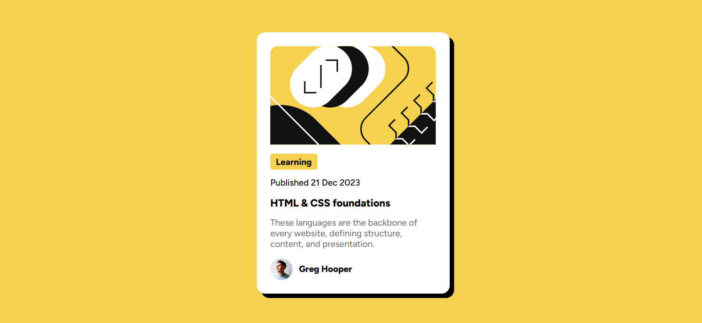

# Blog Preview Card

A simple and elegant blog preview card component built using HTML and CSS. It showcases a minimal design inspired by modern UI cards, typically used to display blog post summaries or featured articles.

## 🚀 Demo

[Click here to view the live site](https://vedantobaleppanavar.github.io/bolg-preview-proj/)

## Screenshot

 

## Technologies Used

- HTML5
- CSS3

## Features

- Clean and responsive layout
- Semantic HTML structure
- Attractive hover effects
- Desktop-first design approach
- Card-style component design suitable for reuse
